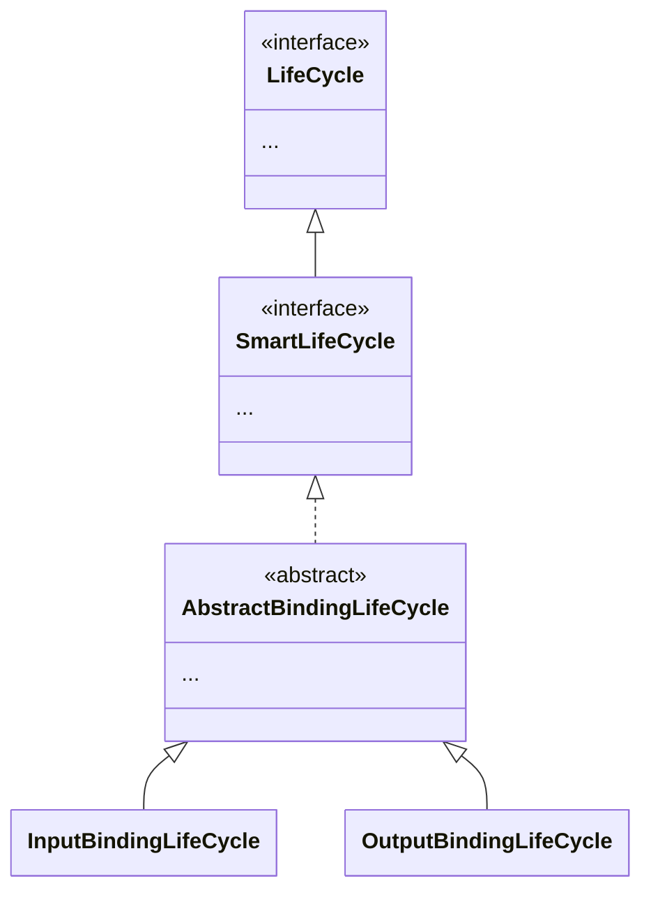

Spring Cloud Stream은 주로 메시지 브로커를 위한 추상화 계층을 제공하는 데 특화되어 있다.
그렇다면 왜 Spring Cloud일까? 또한 어떻게 추상화를 지원하여 유연한 연결을 제공하는지 알아보자.
<!--more-->

## 개요::introduction

### Spring Cloud Stream의 탄생 배경::how-spring-cloud-stream-came-to-be

*"왜 Spring Cloud와 메시지 큐가 연결되었는가?"*

`Spring Cloud`는 클라우드 네이티브 애플리케이션과 마이크로 서비스 개발을 위한 도구 모음이다.
마이크로서비스 간 통신에서 메시지 큐는 핵심 컴포넌트로 비동기 통신을 가능하게 하기때문에 마이크로서비스 아키텍처에서 필요하게 되었다.

또한, 마이크로서비스 환경에서는 서비스간 느슨한 결합(loose coupling)이 중요하기 때문에,
메시지 큐로 서비스 간 비동기 통신을 제공하여 이 문제를 해결하여 분산 시스템 문제를 해결할 수 있다.

### Spring Cloud Stream이 만들어진 이유::why-spring-cloud-stream-was-created

현대에는 RabbitMQ, Kafka, Amazon SQS 등 다양한 메시지 브로커가 존재하며,
각각 사용법과 개념이 달라 애플리케이션 코드가 특정 기술에 종송되는 문제가 있기 때문에 여러 메시징 기술의 추상화가 필요했다.

`Spring Cloud Stream`은 바인더(Binder)라는 개념을 통해 다양한 메시징 시스템을 추상화하였다.
개발자는 기본 메시징 시스템을 알 필요 없이 동일한 코드로 작업하여 일관된 프로그래밍 모델을 제공할 수 있게되었다.

또한 간단한 설정 변경만으로 RabbitMQ에서 Kafka로 또는 반대로 전환이 가능하기 때문에, 기반 기술이 변경되어도 비즈니스 로직 코드는 그대로 유지된다.

> 즉, Spring Cloud Stream은 메시징 시스템의 복잡성을 추상화하고, 마이크로서비스 아키텍처에서 서비스간 통신을 더 쉽게 구현할 수 있도록 만들어졌다.
> 이를 통해 개발자는 비즈니스 로직에 집중하면서도 확장 가능한 분산 시스템을 구축할 수 있게 되었다.
:{ "type": "tip", "icon": "lightbulb" }

## SCS Property 구조::structure-of-spring-cloud-stream-property

```
╭─────────────────────╮    ╭──────────────────────────╮
│ spring.cloud.stream │ ─→ │ BindingServiceProperties │
╰─────────────────────╯    ╰──────────────────────────╯
╭──────────────────────────────╮    ╭───────────────────────────────────────╮
│ spring.cloud.stream.function │ ─→ │ StreamFunctionConfigurationProperties │
╰──────────────────────────────╯    ╰───────────────────────────────────────╯
```

`SCS`에서 제공하는 프로퍼티는 위의 컴포넌트가 대부분이다. `SCS`에서는 거의 대부분의 클라우드 스트림 구성을 위 정보를 이용해 진행한다.
예를 들어 `SCS`에서 추상화 하고 있는 바인딩 정보는 아래와 같다.

```java::BindingServiceProperties
@ConfigurationProperties("spring.cloud.stream")
@JsonInclude(Include.NON_DEFAULT)
public class BindingServiceProperties
	implements ApplicationContextAware, InitializingBean {
    ...
    
    private Map<String, BindingProperties> bindings = new ConcurrentHashMap<>();
    
    ...	
}
```

해당 추상화 바인딩 정보는 각 미들웨어(Message Broker)에서 여러 정보로 매핑된다. Rabbit의 경우 Exchange, Kafka의 경우 Topic으로 대응된다.

### BindingProperties::binding-properties

즉 `BindingProperties`는 연결할 미들웨어의 바인딩 대상이 된다. 위의 코드를 기준으로 바인딩을 비교해 본다면 아래와 같이 대응 된다:

::code-group

```yaml::application.yaml
spring:
  cloud:
    stream:
      bindings:
        GameResultProducer-out-0: # 채널명
          destination: GameResultProducer # 미들웨어 내 바인딩 대상
        GameResultConsumer-in-0:
          destination: GameResultConsumer 
```

```java::BindingServiceProperties.java
private Map<String, BindingProperties> bindings = new ConcurrentHashMap<>();
// "GameResultProducer-out-0" → BindingProperties
// "GameResultConsumer-in-0" → BindingProperties
```

::

`BindingProperties`는 미들웨어 대상(RabbitMQ의 Exchange, Kafka의 Topic)을 추상화한 `SCS`의 바인딩 객체이다. 바인딩 대상은 `Producer`가 될 수도있고,
`Consumer`가 될 수 도있다.

바인딩 정보로서 추상화되며 아래의 내용을 포함한다:

* destination: 바인더가 바인드하는 브로커에서의 물리적인 이름을 의미한다.
  * `RabbitMq`의 경우 Exchange의 이름으로, Kafka의 경우 Topic의 이름으로 정의한다.
* group
  * 그룹의 경우 Consumer에게만 적영되며, 소속될 바인딩의 고유한 이름이다. 많은 컨슈머가 같은 그룹 내에서 구독을 공유한다.
  * null, 빈 문자열 값은 익명그룹을 나타내며 공유 되지않는다.
  * 즉 그룹은 각 미들웨어에서 컨슈머를 묶는 그룹으로 이해하면 된다. `RabbitMQ`의 경유 Queue, `Kafka`의 경우 Consumer Group과 연결된다.
* contentType
  * 이벤트 내에서 이 바인딩으로 사용될 콘텐츠의 유형을 의미한다. HTTP 스펙에서 사용되는 MIME Type과 동일하다. 기본값은 `application/json`
  * 메세지 헤더에 지정되지 않은 경우 이 바인딩에서 사용될 콘텐츠 유형을 지정한다.
* bindier
  * 여러개의 바인더가 사용 가능할 경우 이 바인딩에서 사용할 바인더명
  * 예: rabbit
* consumer
  * 추가적인 컨슈머 프로퍼티 (`ConsumerProperties`)
* producer
  * 추가적인 프로듀서 프로퍼티 (`ProducerProperties`)

## 기본 아키텍쳐 및 컴포넌트의 역할::role-of-each-component-and-basic-architecture

```
╭────────────╮     ╭─────────────────────╮
│  Service A │ ←─→ │ Spring Cloud Stream │ ←──╮
╰─(Producer)─╯     ╰─(Abstraction Layer)─╯    ↓
                                  ╭──────────────────╮
                                  │     RabbitMQ     │    
                                  ╰─(Message Broker)─╯
╭────────────╮     ╭─────────────────────╮    ↑
│  Service B │ ←─→ │ Spring Cloud Stream │ ←──╯
╰─(Consumer)─╯     ╰─(Abstraction Layer)─╯
```

Spring Cloud Stream은 마치 레고 블록과 같다. 여러 레고 조각(마이크로서비스)들이 서로 연결될 수 있도록 표준화된 연결 부분(메세지 시스템 추상화)을 제공한다.
이러한 구성을 만들기위해 몇가지 컴포넌트 개념이 있다.

대략적으로 서비스에 설정되는 정보는 다음과 같다:

```yaml::application.yaml
spring:
  cloud:
    stream: 
      bindings:
        (...설정 A...)
      (...설정 B...)
```

`spring.cloud.stream.bindings` 아래에 들어가는 바인딩 설정은 SCS에서 추상화한 함수와 Binder를 잇는 Binding을 의미한다.
또한, `spring.cloud.stream` 하위에 들어가는 바인딩 설정은 메시징 플랫폼과 위의 Binding을 잇는 Binding을 의미한다.

* BindingServiceProperties: `sping.cloud.stream` 내 프로퍼티 정보
* BindingService: `BindingServiceProperties` 설정 정보를 이용해 실제 바인딩을 구성
* InputBindingLifecycle: `Bindable` 객체를 `BindingService`로 바인딩을 트리거하고 그 정보를 관리
* BindableFunctionProxyFactory: `Bindable`의 구현체이며 추상화 함수와 바인딩할 수 있는

### MessageChannel::message-channel

메세지 채널은 Spring integration에서 가져온 개념으로, 애플리케이션 내에서 메시지가 이동하는 파이프라인 역할

### Binder SPI:binder-service-provider-interface

Binder **S**ervice **P**rovider **I**nterface는 몇개의 인터페이스, 외부 유틸리티 클래스, 외부 미들웨어에 연결하기 위해 연결가능한 메카니즘을 제공하는 발견 전략들로 구성되어있다.
여기서 중요한 점은 SPI는 외부 미들웨어에 입력과 출력을 연결하기 위한 전략인 `Binder`라는 것이다. 다음의 목록은 `Binder` 인터페이스의 정의를 보여준다.

```java::Binder.java
public interface Binder<T, C extends ConsumerProperties, P extends ProducerProperties> {

	default String getBinderIdentity() {
		return String.valueOf(this.hashCode());
	}

	Binding<T> bindConsumer(String name, String group, T inboundBindTarget, C consumerProperties);

	Binding<T> bindProducer(String name, T outboundBindTarget, P producerProperties);
}
```

`C, P`처럼 생산자, 소비자에 대한 설정이 Generic으로 파라미터화 되었으며 여러 확장 지점(Extended Point)을 제공한다:

* 입출력 바인딩 대상 - 메세지를 수신하거나 전송하는 대상(예: Kafka 토픽, RabbitMQ 큐 등)을 바인딩 할수 있는 지점을 의미
* 확장된 소비자 및 생산자 속성 - 특정 Binder 구현(Kafka Binder, RabbitMQ Binder 등)이 타입 안전한 방식으로 지원할 수 있는 추가 속성을 더할 수 있게 해준다는 의미

일반적인 바인더 구현체는 다음의 요소로 구성된다:

* `Binder` 인터페이스를 구현하는 클래스
* 메세징 미들웨어와의 연결 인프라를 설정하는 `Binder`타입 빈을 생성하는 스프링  `@Configuration` 클래스
* 하나 이상의 바인더 정의를 포함하며 클래스 패스에 위치하는 `META-INF/spring.binders` 파일:
  ```text::
  kafka:\
  org.springframework.cloud.stream.binder.kafka.config.KafkaBinderConfiguration
  ```
  ```mermaid

  ```

> 앞서 언급했듯이 바인더 추상화 역시 프레임워크의 확장 지점 중 하나이다. 앞서 나온 목록에서 완전한 바인더를 찾을수 없는 경우 SCS의 상위 에서 바인더를 직접 구현할 수 있다.
> 자세한
> 내용은 [맨 처음부터 SCS 바인더를 생성하는 방법](https://medium.com/@domenicosibilio/how-to-create-a-spring-cloud-stream-binder-from-scratch-ab8b29ee931b)
> 를 참조
:{ "type": "note", "icon": "info" }

## SCS LifeCycle::spring-cloud-stream-life-cycle

SCS의 경우 프레임워크 레벨에서 다음의 라이프사이클을 구현한다.



실제로 바인딩이 진행되는 흐름은 Spring의 `LifeCycle` 로 구현되어있다.
이 `LifeCycle`은 기본적으로 `DefaultLifeCycleProcessor`에 의해 처리되는데, 이는 아래와 같다.

```java::DefaultLifeCycleProcessor.java
private void startBeans(boolean autoStartupOnly) {
    Map<String, Lifecycle> lifecycleBeans = getLifecycleBeans();
    Map<Integer, LifecycleGroup> phases = new TreeMap<>();

    lifecycleBeans.forEach((beanName, bean) -> {
        if (!autoStartupOnly || isAutoStartupCandidate(beanName, bean)) {
            int startupPhase = getPhase(bean);
            phases.computeIfAbsent(startupPhase,
                    phase -> new LifecycleGroup(phase, determineTimeout(phase), lifecycleBeans, autoStartupOnly)
            ).add(beanName, bean);
        }
    });

    //라이프사이클이 실제 시작 되는 부분
    if (!phases.isEmpty()) {
        phases.values().forEach(LifecycleGroup::start);
    }
}
```


:{ "align": "center", "max-width": "600px", "description": "LifeCycle Bean 목록" }

lifecycleBeans는 클래스패스에 포함된 LifeCycle 하위 구현요소들이며, 이를 시작할지를 결정짓는 부분이다.
포스팅을 하는 시점에서는 위와 같이 14개정도가 포함 되어있었다. 어쨋든 동일한 Phase끼리 그룹화 되어, 각 그룹을 한번에 시작한다.

어쨋든 라이프 사이클 그룹을 시작하면 `Bean`을 개별적으로 시작한다. 추상화된 바인딩 정보는 `Bindable`이라는 추상화 객체로서 선언된 함수 `Bean`을 바인딩한다.

**DefaultLifecycleProcessor.java** 파일 내용
::code-group
```java::lifecycle bean을 시작 
private void doStart(Map<String, ? extends Lifecycle> lifecycleBeans, String beanName, boolean autoStartupOnly) {
    Lifecycle bean = lifecycleBeans.remove(beanName);
    if (bean != null && bean != this) {
        String[] dependenciesForBean = getBeanFactory().getDependenciesForBean(beanName);
        for (String dependency : dependenciesForBean) {
            doStart(lifecycleBeans, dependency, autoStartupOnly);
        }
        if (!bean.isRunning() && (!autoStartupOnly || toBeStarted(beanName, bean))) {
            if (logger.isTraceEnabled()) {
                logger.trace("Starting bean '" + beanName + "' of type [" + bean.getClass().getName() + "]");
            }
            try {
                bean.start(); // 시작
            }
            catch (Throwable ex) {
                throw new ApplicationContextException("Failed to start bean '" + beanName + "'", ex);
            }
            if (logger.isDebugEnabled()) {
                logger.debug("Successfully started bean '" + beanName + "'");
            }
        }
    }
}
```
```java::AbstractBindingLifecycle.java
@Override
public void start() {
    if (!this.running) {
        if (this.context != null) {
            this.bindables.putAll(context.getBeansOfType(Bindable.class));
        }
        //각 바인딩을 수행할 수 있는 BindableFactoryBean 목록
        this.bindables.values().forEach(this::doStartWithBindable);
        // "&saveGameResultConsumer_binding" -> BindableFunctionProxyFactory
        // "&saveTransactionResultConsumer_binding" -> BindableFunctionProxyFactory
        //...
        this.running = true;
    }
}
```
```java::InputBindingLifecycle.java
@Override
void doStartWithBindable(Bindable bindable) {
    Collection<Binding<Object>> bindableBindings = bindable
            .createAndBindInputs(this.bindingService); // 실제 바인딩이 구성
    if (!CollectionUtils.isEmpty(bindableBindings)) {
        this.inputBindings.addAll(bindableBindings);
    }
}
```
::

또한 위 라이프사이클 빈 중에서 바인딩 관련은 `InputBindingLifecycle`, `OutputBindingLifecycle`이 있는데 `Input`은 `Consumer`들의 모든 바인딩 정보를,
`Output`은 `Function`등의 바인딩 정보를 가지고 있다.
즉, `DefaultLifecycleProcessor`는 그룹화 된 Life

> 각 팩토리빈이 "&..._binding"의 형태로 구분되어있는데, 이는 설정 적용 과정에서 `FunctionConfiguration`에서 등록되었다. (뒤에서 다시설명)
:{ "type": "tip", "icon": "lightbulb" }


아무튼 위 코드그룹 세번째 코드에 보여진 `createAndBindInput(...)` 메서드로 바인딩이 구성하는데, 이는 각 함수와 바인딩을 생성을 관리하는 `BindableFunctionProxyFactory`
이다.
`SCS`는 철저하게 추상화된 부분만 관리하며, 실제 연동 및 바인딩은 `Binder` 구현체에게 맡긴다.

함수 등록 Bean
FunctionCatalog
FunctionRegistry
FunctionConfiguration: Function Bean을 생성해서 BeanFactory에 넣음 (afterPropertiesSet() 참조)
BeanFactory
ConversionService
RabbitExchangeQueueProvisioner.autoBindDLQ

바인딩
컨슈머 시작 이벤트: AsyncConsumerStartedEvent
이벤트 메세지 멀티캐스트 SimpleApplicationEventMulticaster.multicastEvent()
RabbitExchangeQueueProvisioner

StreamBridge는 ApplicationListener 이다.

AnnotationConfigApplicationContext 에서 메세지 발행시 적절한 ApplicationContext 가 없으면 super인
AnnotationConfigServletWebServerApplicationContext로 publishEvent를 호출하고
그 내부에서, this.applicationMulticaster로 multicastEvent 한다.

간단하게 설명하면, Spring Core는 아래를 수행

1. 앱실행 (Bean refresh)
2. ServletWebServerApplicationContext에서 기본 Bean에대한 refresh가 끝나면 `finishRefresh()` 실행
3. `getLifecycleProcessor().onRefresh()` 실행 (`DefaultLifecycleProcessor`)
4. `DefaultLifecycleProcessor`에서 LifecycleGroup으로 각 `Phase`들을 그룹화
5. 그룹화 된 `Lifecycle Bean`들을 순차적으로 실행

이때 순차적으로 실행되는 Spring Cloud Stream 관련 Lifecycle은 아래를 수행

6. `InputBindingLifecycle`, `OutputBindingLifecycle` 등 doStartWithBindable 메서드로 바인딩을 실행
7. `InputBindingLifecycle` 의 경우 `BindableFunctionProxyFactory.createAndBindInputs(this.bindingService)`를 실행
8. `InputBindingLifecycle`는 매개변수로 받은 바인딩 서비스를 `bindingService.bideConsumer(...)`로 바인딩과정을 위임
9. `BindService`에서 사용할 `Binder`를 찾아 바인딩을 요청한다.
10. 요청을 받은 바인더(여기서는 `RabbitMessageChannelBinder`)는 전달받은 바인딩정보로 인바운드 목적지로 엔드포인트를 지정하여 또 다른 라이프 사이클을 시작한다.
11. `consumerEndpointWithLifecycle.start()`하게 되면 `AmqpInboundChannelAdapter`로 시작된다.
12. 이는 곧바로 `this.messageListenerContainer.start()`로 연결된다.
13. 내부적으로 비동기로 `AsyncMessageProcessingConsumer`를 실행하며 바인딩에 필요한 처리를한다.

여기서 `AsyncMessageProcessingConsumer`는 컨슈머 인스턴스 이며 바인딩된 이후 부터, 메세지 관리를 


