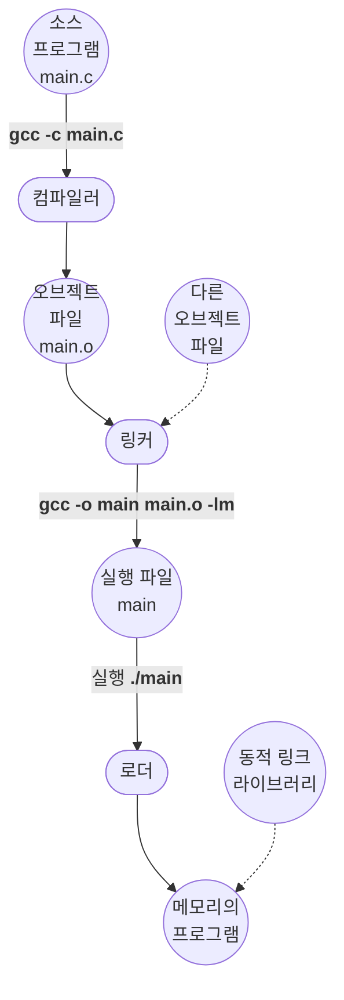

## 개요::overview

일반 적인 실행파일은 바이너리로 디스크에 존재한다.
`Unix/Linux`에서 실행가능한 `.out(c/c++ 컴파일러가 생성한 실행파일)`이나 `Windows`에서 실행가능한 `.exe` 파일이 그 예이다.

링커와 로더는 컴파일과정에서 생성된 실행파일을 메모리에 로드하고 실행가능한 형태로 만드는 역할을 한다.

## 동작 과정::workflow

[`CPU`](/wiki/central-processing-unit)에서 실행하려면 프로그램을 메모리로 가져와 프로세스 형태로 배치되어야 한다.  
아래는 프로그램을 컴파일 하고 메모리에 배치하여 사용가능한 `CPU` 코어에서 실행할 수 있는 과정을 단계별로 설명한다.

`main.c` 파일은 컴파일러에 의해 `main.o` 파일로 컴파일 되며 이는 임의의 메모리에 적재되도록 설계된 오브젝트 파일이다.
이러한 형식을 **재배치 가능 오브젝트 파일**(**R**elocatable **O**bject **F**ile)이라고 한다.  

`링커`는 이러한 `ROF`를 하나의 바이너리 `실행`파일로 결합한다. 이 과정을 링킹이라 하며, 이 단계에서는 표준 C 또는 수학 라이브러리 (flag `-lm`)와 같은 다른 오브젝트 파일을 포함 시킬 수 있다.

`로더`는 이진 실행파일을 메모리에 잭재(load)하는 데 사용되며, `CPU` 코어에서 실행할 수 있는 상태가 된다. 링크 및 로드와 관령된 활동은 재배치(relocation)로, 
프로그램 부분에 최종 주소를 할당 하고 프로그램 코드와 데이터를 해당 주소와 일치하도록 조정하여 프로그램이 실행될 때 코드가 라이브러리 함수를 호출하고 변수에 접근할 수 있게 한다. 

> 링커는 여러 오브젝트 파일에 대한 물리적인 바이너리를 재배치 하는것이고 로더는 이러한 바이너리를 메모리로 로드할 때 논리적인 메모리 주소(가상메모리 주소)를
> 실제 물리적 메모리 주소로 변환하며 주소에 대한 재배치를 수행한다.
:{ "type": "tip", "icon": "lightbulb" }

> 물리적 최종 주소는 프로세스가 할당받는 메모리공간(코드, 데이터, 스택, 힙)으로 프로세스가 접근할 수 있다는 의미이다.
:{ "type": "note", "icon": "info" }

Unix 시스템 CLI(Command Line Interface)에 프로그램 이름(./main)을 입력하면 Shell 프로그램은 `fork()` 시스템 콜을 사용하여 프로그램 실행을 위한, 프로세스를 생성한다.
그후 `exec()`에 실행파일 이름과 함께 로더를 호출한다. 로더는 프로세스 주소에 프로그램 적재한다.

오브젝트 파일과 실행 파일은 일반적으로 표준화된 형식을 가지는데, 
이는 컴파일된 기계 코드 및 프로그램에서 참조되는 함수 및 변수에대한 메타데이터를 포함 하는 기호 테이블을 포함한다. 
이는 변수와 함수에 대한 메타데이터를 모아둔 심볼 테이블(symbol table)이 포함되어 있다. 이러한 심볼들을 링커가 연결한다.

Unix/Linux 시스템에서는 이 표준 형식을 ELF(**E**xecutable and **L**inkable **F**ormat)라고, 
Windows 시스템에서는 PE(**P**ortable **E**xecutable)라고, macOS 시스템에서는 Mach-O 라고한다.

## 동적 링크 라이브러리::dynamic-link-library

링크과정에서 모든라이브러리를 포함하는 것은 비효율적이다. 이러한 문제를 해결하기 위해 동적 링크 라이브러리가 등장하였다.
우리가 흔히 알고 있는 `.so` 또는 `.dll` 파일이 이에 해당한다. Windows 운영체제는 이(**D**ynamically **L**inked **L**ibrary)를 지원한다.

DLL의 장점은 실행파일에서 사용되지 않을 수 있는 라이브러리를 링크만하고 로드는 하지 않아도 된다.
이러한 DLL은 런타임에 필요한 경우 조건부로 로드된다. 대신 동적 링크를 사용할 있도록 링커는 재배치 정보를 프로그램에 추가한다.

이러한 동적 링크 라이브러리는 다음의 방법으로 여러 프로세스에서 공유할 수 있기 때문에 메모리 사용이 크게 절약된다:

1. 프로세스가 DLL/so 라이브러리 함수 호출
2. 링커가 해당 라이브러리 적재 여부 확인
3. 이미 물리 메모리에 로드되어 있다면
   * 해당 물리 메모리 영역을 자신의 가상메모리 주소 공간에 매핑
   * 참조 카운트 증가
4. 그렇지 않다면
   * 라이브러리를 물리 메모리에 로드
   * 자신의 가상메모리 주소 공간에 매핑
   * 참조 카운트 초기화

> 링커는 라이브러리를 로드할 때 이전에 프로그램에 추가했던 재배치 정보를 사용하여 라이브러리를 로드한다. 
:{ "type": "note", "icon": "info" }

> 각 운영체제는 동적 링크 라이브러리에 대한 참조를 관리하며, 참조 카운트가 0이 되면 해당 라이브러리를 언로드한다.
:{ "type": "important", "icon": "warning-octagon" }
