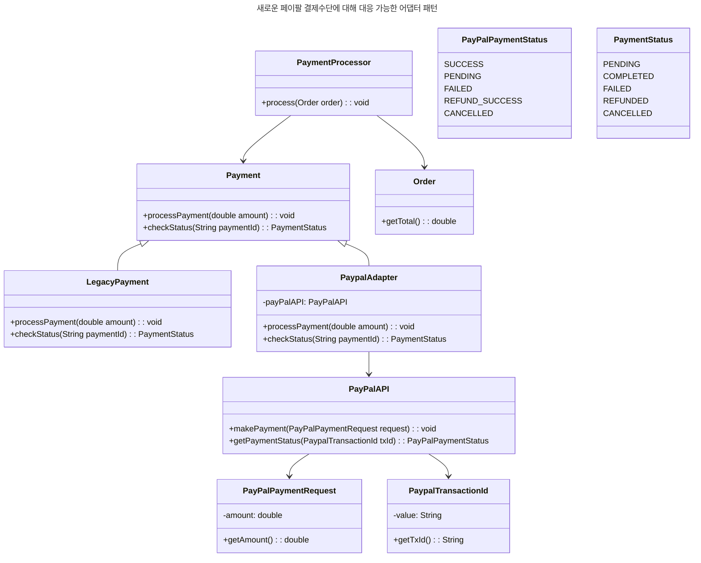

어댑터 패턴은 직접적으로 바로 사용이 불가능한 클래스를 사용할 수 있도록 하는 패턴이다.
이 패턴은 기존의 클래스를 수정하지 않고, 새로운 클래스를 생성하여 기존의 클래스를 사용할 수 있도록 한다.
<!--more-->
## 구성요소

- Target: 어댑터 패턴을 사용하기 위한 인터페이스를 정의한다.
- Adapter: Target 인터페이스를 구현하여 기존의 클래스를 사용할 수 있도록 한다.
- Adaptee: 어댑터 패턴을 사용하기 위한 기존의 클래스이다.
- Client: Adapter 패턴을 사용하는 클래스이다.

## 예제

먼저 Adapter 패턴을 사용하기 위해 선언한 핵심 구성요소는 아래와 같은 클래스들로 구성된다.

### 상황

기존에 사용하던 결제 시스템이 있다고 가정하자. 이 결제 시스템은 `Payment` 인터페이스를 구현하고 있다.
하지만, 새로운 결제수단으로 PayPal을 사용하고자 한다. PayPal은 `PayPalAPI` 클래스를 사용하여 결제를 처리한다.
이를 위해 추가적인 코드의 작성이 필요한 상황이다.


### 구성요소 정의 

::code-group

```Payment.java
public interface Payment {

    void processPayment(double amount);

    PaymentStatus checkStatus(String paymentId);
}

```
```PayPalAPI.java
public class PayPalAPI {

    public void makePayment(PayPalPaymentRequest request) {
        System.out.println("Making PayPal payment of " + request.getAmount());
    }

    public PayPalPaymentStatus getPaymentStatus(PaypalTransactionId txId) {
        return PayPalPaymentStatus.SUCCESS;
    }
}
```
```PayPalAdapter.java
public class PaypalAdapter implements Payment {

    private final PayPalAPI payPalAPI;

    public PaypalAdapter(PayPalAPI payPalAPI) {
        this.payPalAPI = payPalAPI;
    }

    @Override
    public void processPayment(double amount) {
        PayPalPaymentRequest request = new PayPalPaymentRequest(amount);
        payPalAPI.makePayment(request);
    }

    @Override
    public PaymentStatus checkStatus(String paymentId) {
        PaypalTransactionId txId = new PaypalTransactionId(paymentId);
        PayPalPaymentStatus paymentStatus = payPalAPI.getPaymentStatus(txId);

        return convertPayPalStatus(paymentStatus);
    }
    ...
}
```
```PaymentProcessor.java
public class PaymentProcessor {

    private final Payment paymentSystem;

    public PaymentProcessor(Payment paymentSystem) {
        this.paymentSystem = paymentSystem;
    }

    public void process(Order order) {
        paymentSystem.processPayment(order.getTotal());
        //결제상태 확인
        PaymentStatus paymentStatus = paymentSystem.checkStatus("AE2D123-12");
        System.out.println("Payment status: " + paymentStatus);

    }
}
```

::

위의 코드로 어댑터 패턴의 핵심 구성요소를 설명하면 다음과 같다.

* Target: Payment.java
* Adapter: PaypalAdapter.java
* Adaptee: PayPalAPI.java
* Client: PaymentProcessor.java

그리고 예시를 위해 추가적인 데이터가 아래와 같이 있다고 가정 한다.

::code-group
```PayPalPaymentRequest.java
//페이팔 결제 요청정보
public class PayPalPaymentRequest {

    private final double amount;

    public PayPalPaymentRequest(double amount) {
        this.amount = amount;
    }

    public double getAmount() {
        return amount;
    }
}
```

```PaypalTransactionId.java
//페이팔 결제 ID
public class PaypalTransactionId {

    private final String txId;

    public PaypalTransactionId(String txId) {
        this.txId = txId;
    }

    public String getTxId() {
        return txId;
    }
}
```

```Order.java
//주문 정보
public class Order {

    private final double total;

    public Order(double total) {
        this.total = total;
    }

    public double getTotal() {
        return total;
    }
}
```
::

위 정보를 조합하면 각 클래스간 역할 및 관계는 다음과 같다.



Adapter 패턴의 사용으로 새로운 결제수단이 추가되어도 기존의 결제처리 로직을 변경하지 않고 사용할 수 있다.
* PayPalAdapter는 Payment 인터페이스를 구현하여 내부적으로 PayPalAPI를 사용하며, 기존 결제에 대한 행동에는 변화가 없다.
* Payment 역할을 그대로 수행하며 내부적으로 실제 처리과정만 다를 뿐이다.

### 사용

```java
Order order = new Order(100.0);

PaymentProcessor processor = LocalDate.now().isBefore(LocalDate.of(2021, 4, 13))
        ? new PaymentProcessor(new LegacyPayment())
        : new PaymentProcessor(new PaypalAdapter(new PayPalAPI()));

processor.process(order);
```

> 예를들어 `2021-04-13` 부터 PayPal 결제로만 서비스를 제공한다고 가정하면, 위와 같이 사용할 수 있다.
:{ "type": "tip", "icon": "info" }
