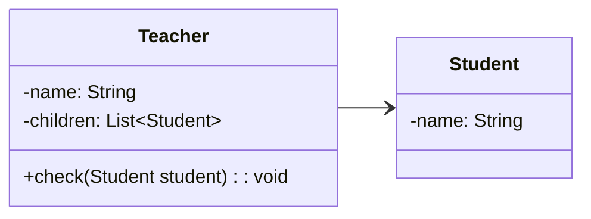
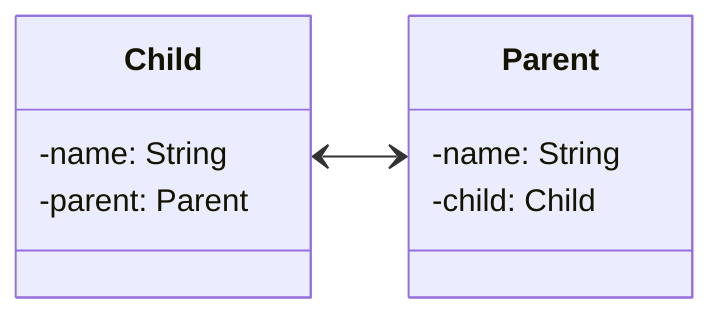
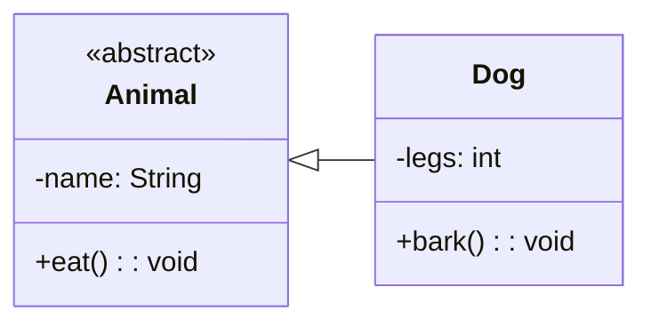

소프트 웨어에서는 각 객체와 객체 간의 관계를 표현하기 위해 클래스 다이어그램을 사용한다. 

클래스 다이어그램은 클래스의 속성과 메서드를 표현하고, 클래스 간의 관계를 표현한다. 
클래스 다이어그램은 객체 지향 프로그래밍에서 가장 많이 사용되는 다이어그램 중 하나이다.

클래스 다이어그램의 구성요소를 알아보자. 

<!--more-->

## 관계를 나타내는 화살표::relationship-line

:{ "align": "center", "max-width": "400px", "description": "클래스간의 관계를 나타내는 Relationship Line" }

클래스 다이어그램에서는 클래스간 관계를 나타내는 화살표를 사용한다.
각 관계를 나타내는 의미를 알아보자.

### Associations (연관)::associations

*한 모델 요소의 인스턴스들이 다른 모델 요소의 인스턴스들과 연결되었다는 것을 나타낸다.*

**단방향 연관 관계**

이 다이어 그램은 학생과 선생님의 관계를 나타낸다. 선생님은 학생들을 관리하기 위해 항상 참조한다.
하지만, 학생은 선생님이 관심 없기 때문에 신경을 안쓰므로 학생은 선생님을 참조하지 않는다.
이는 단방향 관계이다.

**양방향 연관관계**

하지만 반대로 자식과 부모의 관계는 양방향 관계이다. 부모는 자식과, 자식은 부모와 가족이기 때문에 서로를 참조한다.

> 이처럼 단방향 또는 양방향으로 어떤 모델의 인스턴스를 참조하는 관계를 `연관관계`라고 한다.
:{ "type": "tip", "icon": "lightbulb" }

> 연관 관계는 참조하려는 객체를 내부적으로 갖고 있어야한다.
:{ "type": "note", "icon": "info" }

### Inheritances (상속)::inheritances

*한 클래스가 다른 클래스의 특성을 상속받았다는 것을 나타낸다.*

이는 구현과는 다르며, 상속은 클래스 간의 관계를 나타낸다.

