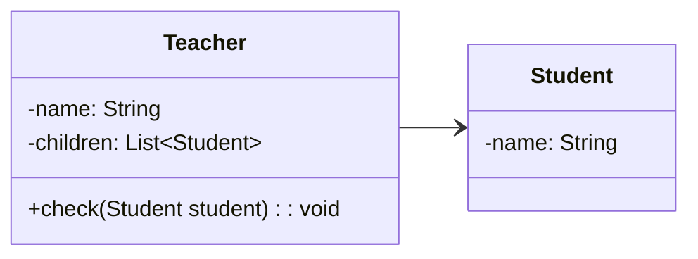
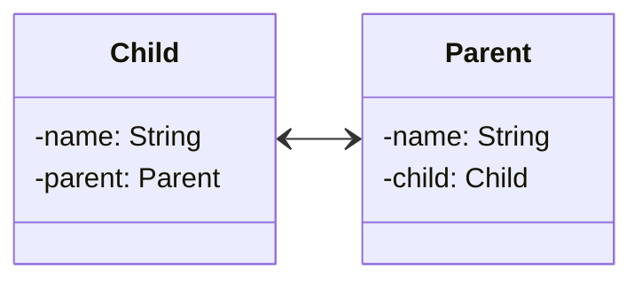
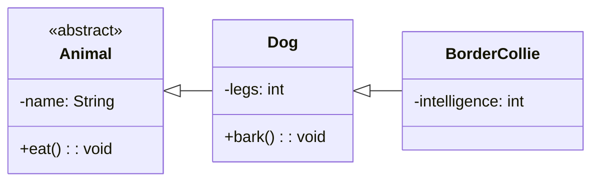
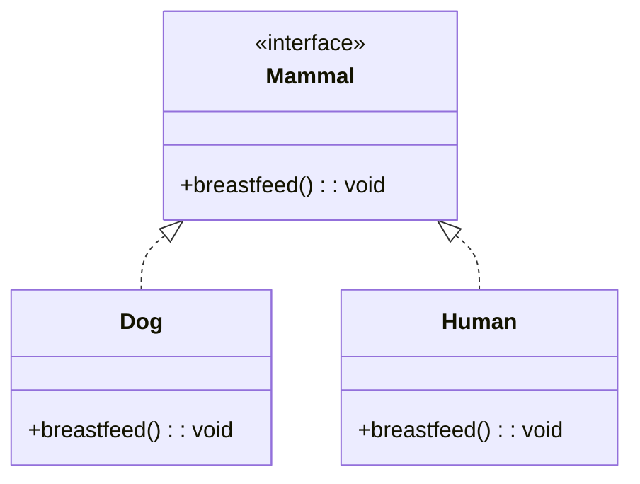
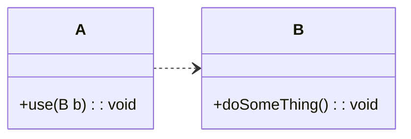
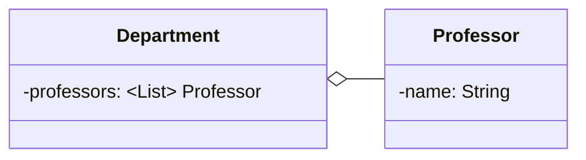
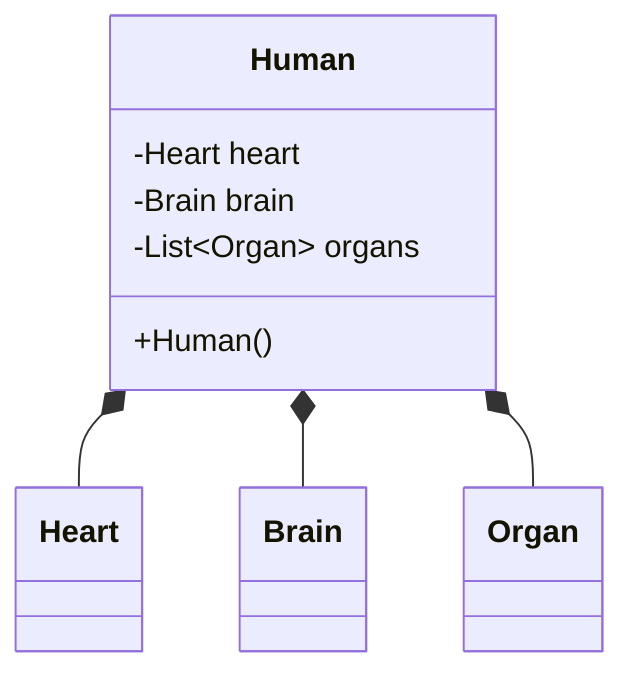

소프트 웨어에서는 각 객체와 객체 간의 관계를 표현하기 위해 클래스 다이어그램을 사용한다. 

클래스 다이어그램은 클래스의 속성과 메서드를 표현하고, 클래스 간의 관계를 표현한다. 
클래스 다이어그램은 객체 지향 프로그래밍에서 가장 많이 사용되는 다이어그램 중 하나이다.

클래스 다이어그램의 구성요소를 알아보자. 

<!--more-->

## 관계를 나타내는 화살표::relationship-line

:{ "align": "center", "max-width": "400px", "description": "클래스간의 관계를 나타내는 Relationship Line" }

클래스 다이어그램에서는 클래스간 관계를 나타내는 화살표를 사용한다.
각 관계를 나타내는 의미를 알아보자.

### Associations (연관)::associations

*한 모델 요소의 인스턴스들이 다른 모델 요소의 인스턴스들과 연결되었다는 것을 나타낸다.*

**단방향 연관 관계**

이 다이어 그램은 학생과 선생님의 관계를 나타낸다. 선생님은 학생들을 관리하기 위해 항상 참조한다.
하지만, 학생은 선생님이 관심 없기 때문에 신경을 안쓰므로 학생은 선생님을 참조하지 않는다.
이는 단방향 관계이다.

**양방향 연관관계**

하지만 반대로 자식과 부모의 관계는 양방향 관계이다. 부모는 자식과, 자식은 부모와 가족이기 때문에 서로를 참조한다.

> 이처럼 단방향 또는 양방향으로 어떤 모델의 인스턴스를 참조하는 관계를 `연관관계`라고 한다.
:{ "type": "tip", "icon": "lightbulb" }

> 연관 관계는 참조하려는 객체를 내부적으로 갖고 있어야한다.
:{ "type": "note", "icon": "info" }

### Inheritances (상속)::inheritances

*한 클래스가 다른 클래스의 특성을 상속받았다는 것을 나타낸다.*

이는 구현과는 다르며, 상속은 클래스 간의 관계를 나타낸다.

이 다이어그램은 `Animal` 클래스가 `Dog` 클래스에 상속되고, `Dog` 클래스가 `BorderCollie` 클래스에 상속되는 상속 관계를 나타낸다.

> 상속은 `interface`가 아닌 `Abstract Class` 또는 일반 `Class` 에서만 사용할 수 있다.
:{ "type": "note", "icon": "info" }

### Realizations (실체화)::realizations

*한 클래스가 인터페이스를 구현했다는 것을 나타낸다.*

다른말로 `implementation` 이라고도 한다. 즉 구현하여 실체화하는 경우를 의미한다.

포유류는 젖을 먹여 새끼를 키우는 동물을 일컷는 말이다. 포유류는 분류를 하기 위해 나눈 개념이기 때문에 실체가 아니다.
이를 실체화 하기위해 `Dog`와 `Human` 클래스가 `Mammal` 인터페이스를 구현하고 있다.

> `Realization`/`Implementation` 관계는 `interface`를 구현하는 클래스에 사용된다.
:{ "type": "note", "icon": "info" }

### Dependencies (의존)::dependencies

*한 클래스가 다른 클래스에 의존하는것을 의미한다.*

> 어떤 행위를 할 때 다른 클래스를 필요로 하는 경우 `의존`관계에 해당된다.
:{ "type": "note", "icon": "info" }

### Aggregations (집합)::aggregations

*한 클래스가 다른 클래스를 소유하고 있다는 것을 나타낸다.*

> `집합` 관계는 `연관` 관계와 유사하지만, 의미론적으로 다르다.
:{ "type": "important", "icon": "warning-octagon" }

만약 교수가 학과에 속해있다면, 이러한 관계를 `집합` 관계라고 한다. **필드로 갖고 있다는 개념이 비슷하지만,** 
연관 관계에서는 **참조**를 의미하고 집합 관계에서는 **소유**를 의미한다.

### Compositions (합성)::compositions

*한 클래스가 다른 클래스에 종속하고 있다는 것을 나타낸다.*

> `합성` 관계는 `집합` 관계와 유사하지만, 의미론적으로 다르다. **Aggregation**은 독립적 이지만, **Composition**은 종속적이다.
:{ "type": "important", "icon": "warning-octagon" }

만약 사람이 심장, 뇌, 장기를 가지고 있다면, 각각의 구성요소는 사람에 종속적이다. 이러한 관계를 `합성` 관계라고 한다.

> **공유 불가능**: `합성` 관계에서는 한 객체의 부분이 다른객체에 속할 수 없고, 부분 객체가 여러 객체에 동시에 속할 수 없다. 또한 부분 객체의 독립적인 재사용이 불가능하다.
:{ "type": "caution", "icon": "x-circle" }
