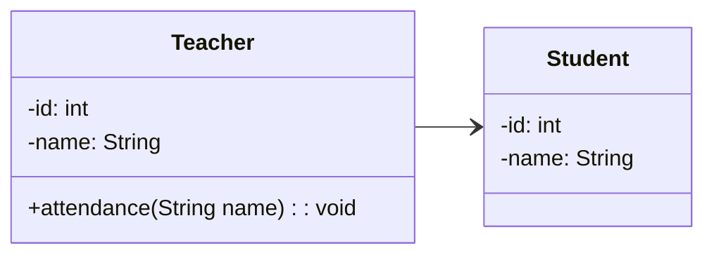

소프트 웨어에서는 각 객체와 객체 간의 관계를 표현하기 위해 클래스 다이어그램을 사용한다. 

클래스 다이어그램은 클래스의 속성과 메서드를 표현하고, 클래스 간의 관계를 표현한다. 
클래스 다이어그램은 객체 지향 프로그래밍에서 가장 많이 사용되는 다이어그램 중 하나이다.

클래스 다이어그램의 구성요소를 알아보자. 

<!--more-->

## 관계를 나타내는 화살표::relationship-line

:{ "align": "center", "max-width": "400px", "description": "클래스간의 관계를 나타내는 Relationship Line" }

클래스 다이어그램에서는 클래스간 관계를 나타내는 화살표를 사용한다.
각 관계를 나타내는 의미를 알아보자.

### Association (연관)::association

