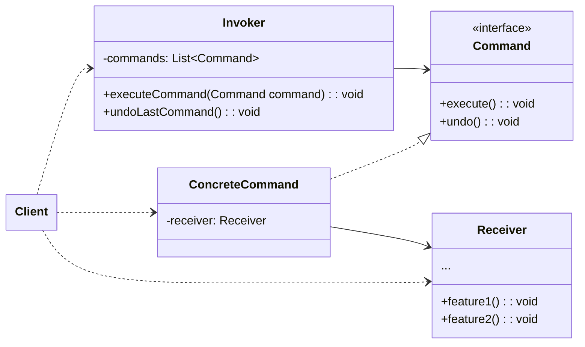

커맨드 패턴은 처리 명령을 독립적인 실행가능 객체로 만들어, 일괄적으로 취소 또는 실행을 할 수 있도록 하는 디자인 패턴이다.

또한, 이 명령의 처리를 지연시키거나, 대기열에 넣을 수 있도록 하여 처리할 수 있다.
<!--more-->
## 핵심 구성요소::key-components

* **Command**: 명령을 나타내는 인터페이스/추상 클래스
* **ConcreteCommand**: 실제 명령을 나타내는 구상 클래스
* **Invoker**: 명령을 실행하는 객체
* **Receiver**: 명령의 수신자
* **Client**: ConcreteCommand 객체를 생성하고 Invoker 객체에게 전달하는 객체



## 예제::example

예제를 통해 커맨드 패턴을 살펴보기 전에, 다음의 역할과 책임을 명심하자.

* `Invoker`
  * **역할**: 명령 호출자 객체이며, 명령을 목록을 관리한다.
  * **책임**: 명령을 실행하거나 취소한다.
* `Command`
  * **역할**: 명령의 구현이며, 비즈니스 논리 객체중 하나에게 호출을 전달한다.
  * **책임**: 명령에 대한 실행과 취소를 `Receiver` 객체를 이용해 수행한다.
* `Receiver`
  * **역할**: 외부에서 호출을 전달받는다.
  * **책임**: 전달 받은 호출에대한 비즈니스 로직을 수행한다.
* `Client`
  * **역할**: 실제 명령을 `Invoker`에게 전달한다.
  * **책임**: 실제 명령을 생성하여 `Invoker`와 연결하며, 실행흐름을 제어한다.


### 주문 처리 시스템::example-1

주문 처리에 대한 시스템을 만들고자 한다.
구매하는 상품에대한 주문이있고, 해당 주문에 대하여 생성하거나 변경하는 기능을 만들어보자. 

**Command**

수행하려는 주문 행위에 단위의 명령을 구현한다.

::code-group

```java::주문 명령
public interface OrderCommand {

    void execute();

    void undo();
}
```

```java::주문생성 명령
public class CreateOrderCommand implements OrderCommand {

    private final OrderManager receiver;
    private final Order order;

    public CreateOrderCommand(OrderManager receiver, Order order) {
        this.receiver = receiver;
        this.order = order;
    }

    @Override
    public void execute() {
        this.receiver.createOrder(order);
    }

    @Override
    public void undo() {
        this.receiver.cancelOrder(order);
    }
}
```

```java::주문변경 명령
public class UpdateOrderCommand implements OrderCommand {

    private OrderManager receiver;
    private Order order;
    private OrderStatus previousOrder;
    private OrderStatus newStatus;

    public UpdateOrderCommand(OrderManager receiver, Order order, OrderStatus newStatus) {
        this.receiver = receiver;
        this.order = order;
        this.newStatus = newStatus;
        this.previousOrder = order.getStatus();
    }

    @Override
    public void execute() {
        receiver.updateOrderStatus(order, newStatus);
    }

    @Override
    public void undo() {
        receiver.updateOrderStatus(order, previousOrder);
    }
}
```

::

**Invoker**

주문처리 행위에대한 명령들을 관리하며, 실행하거나 취소할 수 있다.

```java::주문 처리에 대한 호출자
public class OrderCommandInvoker {
    private final List<OrderCommand> commands = new ArrayList<>();

    public void executeCommand(OrderCommand command) {
        command.execute();
        commands.add(command);
    }

    public void undoLastCommand() {
        if (!commands.isEmpty()) {
            OrderCommand lastCommand = commands.remove(commands.size() - 1);
            lastCommand.undo();
        }
    }

}
```

**Receiver**

`Invoker`가 호출하는 `Command`에 대한 실제 비즈니스 로직을 수행한다.

```java::주문 처리의 수신자
public class OrderManager {
    private List<Order> orders = new ArrayList<>();

    public void createOrder(Order order) {
        orders.add(order);
        System.out.println("Order created: " + order.getOrderId());
    }

    public void cancelOrder(Order order) {
        orders.remove(order);
        System.out.println("Order cancelled: " + order.getOrderId());
    }

    public void updateOrderStatus(Order order, OrderStatus status) {
        order.setStatus(status);
        System.out.println("Order " + order.getOrderId() + " status updated to: " + status);
    }

    public List<Order> getOrders() {
        return orders;
    }
}
```

**Client**

전반적인 실행흐름을 제어하며, `Command`를 생성하여 Invoker에게 전달한다.

```java::클라이언트 코드
OrderManager receiver = new OrderManager();
OrderCommandInvoker invoker = new OrderCommandInvoker();

//Create Command
Product laptop = new Product("Laptop", 999.99);
Product phone = new Product("Phone", 499.00);

//CreateOrder
Order order = new Order(List.of(laptop, phone));

//Create Order Command
CreateOrderCommand createCommand = new CreateOrderCommand(receiver, order);
invoker.executeCommand(createCommand);

//Update Order Command
UpdateOrderCommand updateCommand = new UpdateOrderCommand(receiver, order, OrderStatus.SHIPPED);
invoker.executeCommand(updateCommand);

//undo last command
invoker.undoLastCommand();
```

### 게임 컨트롤러::example-2

간단한 슈퍼마리오 게임을 만드려고한다.
앞으로 또는 뒤로 가거나 점프를 할 수 있으며, 공격도 가능하다.

**Command**

게임 컨트롤러에서 수행할 있는 명령들을 `Command`로 추상화하여 구현한다.

::code-group


```java::게임 명령
public interface Command {

    void execute();
    void undo();
}
```

```java::점프 명령
public class JumpCommand implements Command {
    private GameCharacter receiver;
    
    public JumpCommand(GameCharacter receiver) {
        this.receiver = receiver;
    }

    @Override
    public void execute() {
        this.receiver.jump();
    }

    @Override
    public void undo() {
        System.out.println("Jump command undone");
    }
}
```

```java::이동 명령
public class MoveCommand implements Command {
    private GameCharacter receiver;

    public MoveCommand(GameCharacter character) {
        this.receiver = character;
    }

    @Override
    public void execute() {
        receiver.moveForWard();
    }

    @Override
    public void undo() {
        receiver.moveBack();
    }
}
```

```java::공격 명령
public class AttackCommand implements Command {

    private GameCharacter receiver;

    public AttackCommand(GameCharacter receiver) {
        this.receiver = receiver;
    }

    @Override
    public void execute() {
        receiver.attack();
    }

    @Override
    public void undo() {
        System.out.println("Attack command undone");
    }
}
```

::

**Invoker**

사용자(`Client`)와 인터페이스 할 수 있는 컨트롤러이다.
실제 명령을 호출하거나, 취소하며 명령들을 관리한다.

```java::게임 컨트롤러
public class GameController {
    private Command[] buttons = new Command[3];
    private List<Command> commandHistory = new ArrayList<>();

    public void setCommand(int slot, Command command) {
        buttons[slot] = command;
    }

    public void pressButton(int slot) {
        if (buttons[slot] != null) {
            buttons[slot].execute();
            commandHistory.add(buttons[slot]);
        }
    }

    public void undoLastCommand() {
        if (!commandHistory.isEmpty()) {
            Command lastCommand = commandHistory.remove(commandHistory.size() - 1);
            lastCommand.undo();
        }
    }
}
```

**Receiver**

외부에서 전달되는 명령을 수행하는 주체적인 객체 자체이다.
게임 캐릭터이며, 실제 비즈니스 로직을 수행한다. 캐릭터는 스스로 움직이지는 않지만, 외부 명령에 대해 캡슐화하여 이에 맞는 동작을 스스로 판단하여 수행한다.


```java::캐릭터
public class GameCharacter {

    private final String name;
    private int positionX = 0;
    private int positionY = 0;

    public GameCharacter(String name) {
        this.name = name;
    }

    public void moveForWard() {
        this.positionX += 1;
        System.out.println(name + " moved forward to position X: " + this.positionX);
    }

    public void moveBack() {
        this.positionX -= 1;
        System.out.println(name + " moved back to position X: " + this.positionX);
    }

    public void jump() {
        positionY += 2;
        System.out.println(name + " jumped to height Y: " + positionY);
        // 중력으로 인해 다시 내려옴
        positionY = 0;
    }

    public void attack() {
        System.out.println(name + " performed attack!");
    }
}
```

**Client**

```java::클라이언트 코드
// Receiver 생성
GameCharacter mario = new GameCharacter("Mario");

// Commands 생성
Command moveCommand = new MoveCommand(mario);
Command jumpCommand = new JumpCommand(mario);
Command attackCommand = new AttackCommand(mario);

// Invoker 설정
GameController controller = new GameController();
controller.setCommand(0, moveCommand);  // 버튼 0: 이동
controller.setCommand(1, jumpCommand);  // 버튼 1: 점프
controller.setCommand(2, attackCommand); // 버튼 2: 공격

// 게임 플레이 시뮬레이션
System.out.println("=== Game Start ===");
controller.pressButton(0); // 이동
controller.pressButton(1); // 점프
controller.pressButton(2); // 공격

System.out.println("\n=== Undo Last Action ===");
controller.undoLastCommand(); // 마지막 명령 취소
```

> 커맨드 패턴은 각 구성요소 간 역할(전달, 실행, 관리)을 분리하여 객체간 결합도를 낮추어 유연한 구조로 명령들을 수행할 수 있다.
:{ "type": "tip", "icon": "lightbulb" }


## 적용::applicability

커맨드 패턴의 구성 요소는 결합도를 낮추기위해 존재하지만, 가장 큰 이점은 각 명령이 독립적으로 실행가능한 객체로 만들어진다는 것이다.  

이는, `Receiver` 스스로는 수행될 명령을 알 필요가 없으며, 내부 의존 객체에 대해서 상태를 변경할 수 있는 인터페이스만 제공하면, `Command`에서 확장하여 기능을 만들어 사용할 수 도 있기 때문이다.  

이 확장을 이용해, 독립적으로 행위의 단위를 추상화 하여 명령을 수행 하거나 취소 한다. `Client`는 이러한 단순화된 명령을 필요에 맞게 호출자에게 전달만 한다면, `Invoker`는 명령을 실행하거나 취소하는 역할만 수행하면 된다.

커맨드 패턴은 작업들의 실행을 **예약**하거나, 큐잉(Queueing)할 수 있으며, **로그**를 남기거나 **복구**할 수 있는 기능을 제공하기 때문에, **직렬화된 실행 단위의 구조**에서 사용하기 적합하다. 


## 장단점::pros-and-cons

**장점**

* [단일 책임 원칙](): 작업을 호출하는 클래스들을 수행하는 클래스들로 부터 분리할 수 있다.
* [개방/폐쇄 원칙](): 기존 클라이언트 코드를 손상하지 않고 앱에 새 커맨드들을 도입할 수 있다.
* 실행 취소또는 재실행을 구현할 수 있다.
* 작업들의 지연된 실행을 구현할 수있다.
* 간단한 커맨드들의 집합을 복잡한 커맨드로 조합할 수 있다

**단점**

* 발송자와 수신자 사이에 추가 클래스를 도입하여 코드 복잡성이 증가할 수 있다.
