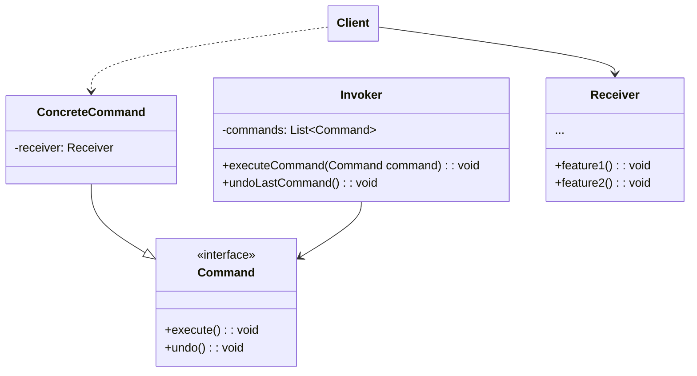

커맨드 패턴은 처리 명령을 독립적인 실행가능 객체로 만들어, 일괄적으로 취소 또는 실행을 할 수 있도록 하는 디자인 패턴이다.

또한, 이 명령의 처리를 지연시키거나, 대기열에 넣을 수 있도록 하여 처리할 수 있다.
<!--more-->
## 핵심 구성요소::key-components

* **Command**: 명령을 나타내는 인터페이스/추상 클래스
* **ConcreteCommand**: 실제 명령을 나타내는 구상 클래스
* **Invoker**: 명령을 실행하는 객체
* **Receiver**: 명령의 수신자
* **Client**: ConcreteCommand 객체를 생성하고 Invoker 객체에게 전달하는 객체

## 예제::example

## 적용::applicability

## 장단점::pros-and-cons

**장점**

*

**단점**

* 
