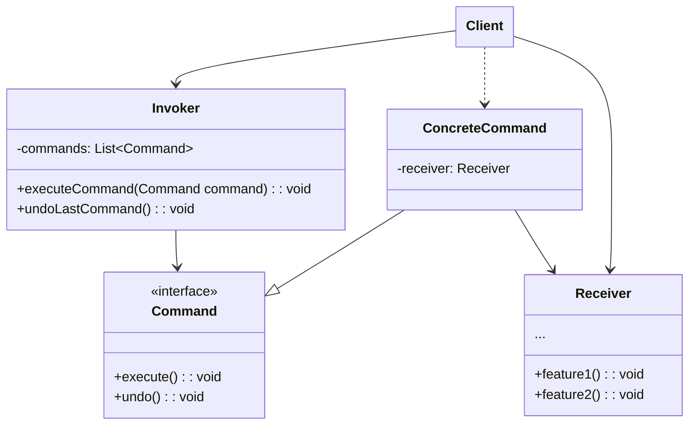

커맨드 패턴은 처리 명령을 독립적인 실행가능 객체로 만들어, 일괄적으로 취소 또는 실행을 할 수 있도록 하는 디자인 패턴이다.

또한, 이 명령의 처리를 지연시키거나, 대기열에 넣을 수 있도록 하여 처리할 수 있다.
<!--more-->
## 핵심 구성요소::key-components

* **Command**: 명령을 나타내는 인터페이스/추상 클래스
* **ConcreteCommand**: 실제 명령을 나타내는 구상 클래스
* **Invoker**: 명령을 실행하는 객체
* **Receiver**: 명령의 수신자
* **Client**: ConcreteCommand 객체를 생성하고 Invoker 객체에게 전달하는 객체

## 예제::example

예제를 통해 커맨드 패턴을 살펴보기 전에, 다음의 역할과 책임을 명심하자.

* `Invoker`
  * **역할**: 명령 호출자 객체이며, 명령을 목록을 관리한다.
  * **책임**: 명령을 실행하거나 취소한다.
* `Command`
  * **역할**: 실제 명령을 구현하는 객체는 비즈니스 논리 객체중 하나에게 호출을 전달한다.
  * **책임**: 명령에 대한 실행과 취소를 `Receiver` 객체를 이용해 수행한다.
* `Receiver`
  * **역할**: 외부에서 호출을 전달받는다.
  * **책임**: 전달 받은 호출에대한 비즈니스 로직을 수행한다.
* `Client`
  * **역할**: 실제 명령을 `Invoker`에게 전달한다.
  * **책임**: 실제 명령을 생성하여 `Invoker`와 연결하며, 실행흐름을 제어한다.

## 주문 처리 시스템::example-1

## 적용::applicability

## 장단점::pros-and-cons

**장점**

*

**단점**

* 
